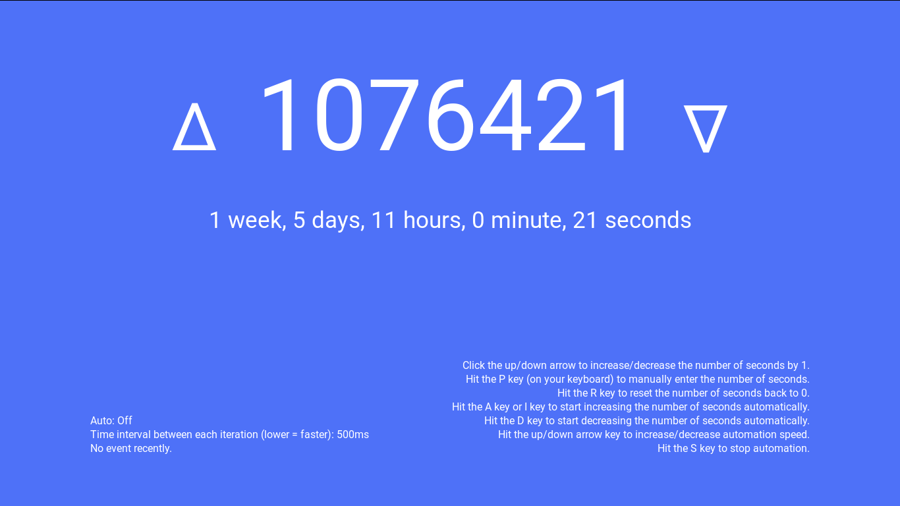
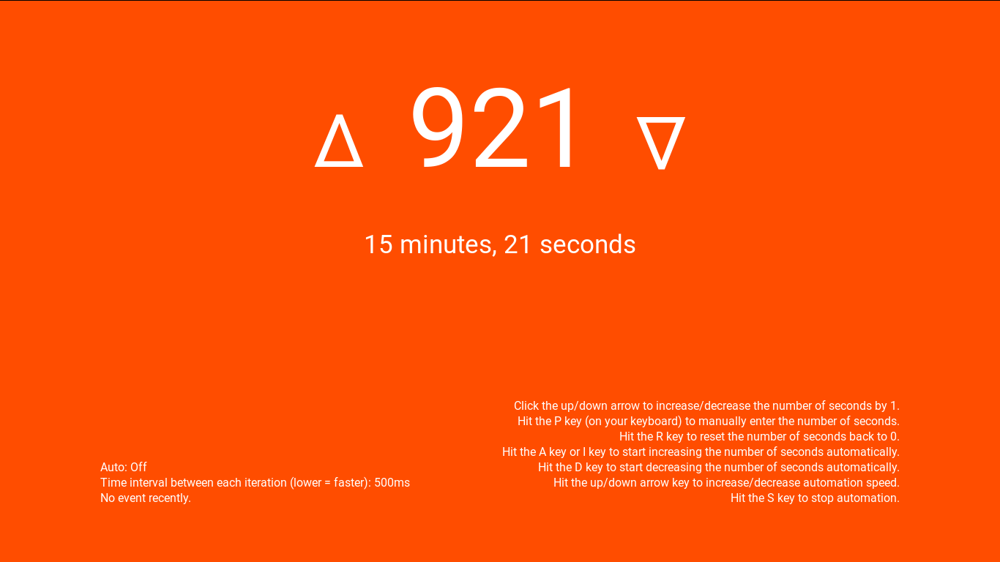
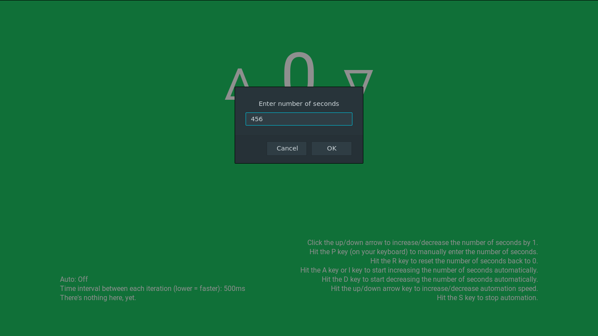

timestr.js
==========

Convert number of seconds into a long format that includes weeks, days, hours,
minutes, seconds.

What's in this repository?
-------------------------

1. `index.html`, `style.css`: HTML and CSS code for http://novaglow.github.io/timestr.
2. `script.js`: JavaScript script for http://novaglow.github.io/timestr.
3. `timestr.js`: Contains function that does the main job of converting. **You
can use this in your project.**
4. `LICENSE`: A copy of the CC0 license.
5. Preview images (the PNGs).

TODO
----

- [x] Liberate the JavaScript code
- [ ] Make website responsive
- [ ] Improve visual
- [ ] Add formats too (like DD HH MM SS)

License
-------

Everything in this repository is licensed under the
[Creative Commons Zero v1.0 Universal](LICENSE) license, so basically, this work
is dedicated to the Public Domain and you can do anything!
